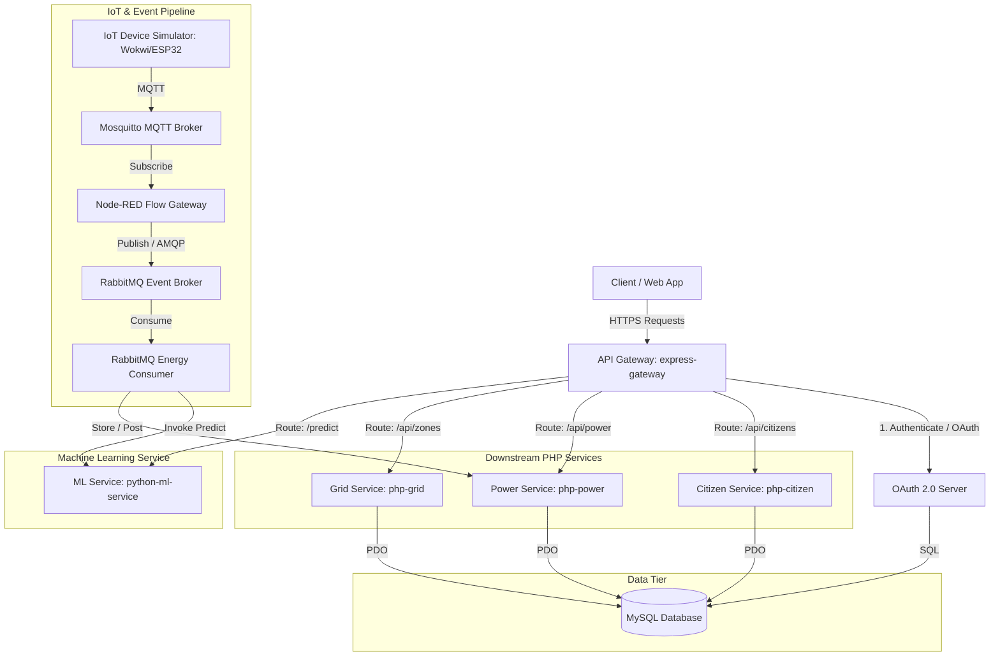
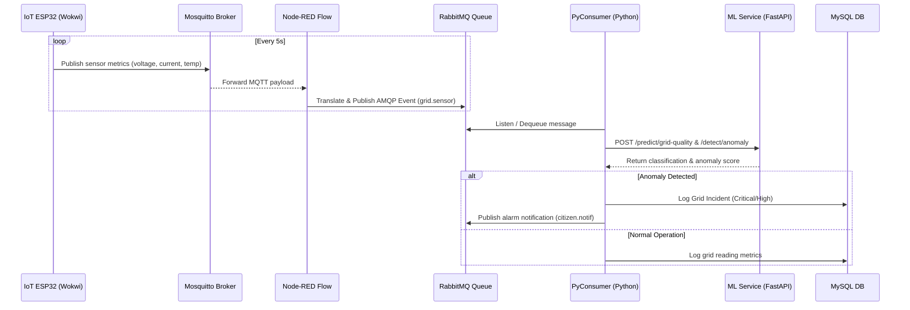

# Smart City Integrated Platform - Architecture Design

This document details the architecture and data flows for the Smart City Integrated Platform, focusing on the Smart Energy / Power Grid sub-theme.

## Component Architecture

The platform is designed as a microservices architecture consisting of an API Gateway, an OAuth 2.0 Authorization Server, three downstream PHP services, a Python ML Service, and an IoT pipeline.

## System Component Details

1. **API Gateway (`express-gateway/`)**
   - Serves as the central entry point for all API requests.
   - Performs JWT signature verification and role-based access control (RBAC).
   - Implements rate limiting to prevent denial of service.

2. **OAuth 2.0 Authorization Server (`oauth-server/`)**
   - Handles client credentials and password grants.
   - Issues JSON Web Tokens (JWT) for authenticated users/services.

3. **Citizen Downstream Service (`php-citizen/`)**
   - Manages citizen profiles, complaints/reports, and user notifications.
   - Interacts with MySQL for user persistence.

4. **Power Downstream Service (`php-power/`)**
   - Tracks power consumption and forecast demands.
   - Log weather parameters to calculate correlations.

5. **Grid Downstream Service (`php-grid/`)**
   - Tracks transformer load, voltages, and currents.
   - Dispatches incident reports if anomaly thresholds are exceeded.

6. **Python ML Service (`python-ml-service/`)**
   - Runs model inference for Power Demand (regression), Grid Quality (classification), and Anomaly Detection (Isolation Forest).
   - Integrates with RabbitMQ consumer to process real-time sensor streams.

7. **IoT Pipeline (`iot/`)**
   - Uses Wokwi to simulate physical sensors (current, voltage, temperature) on an ESP32.
   - Connects to Mosquitto and utilizes Node-RED to translate MQTT messages into RabbitMQ AMQP events.

## Real-Time Data Flow (IoT Anomaly & Prediction)

The diagram below details the sequence of events from sensor reading to database storage and ML prediction.

