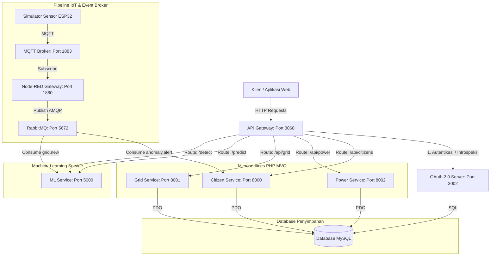
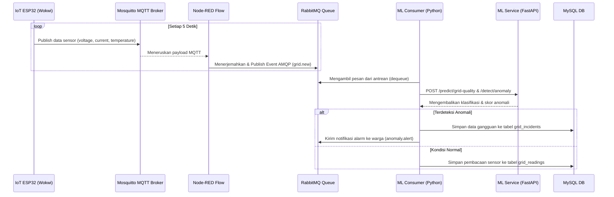

# Desain Arsitektur Sistem — Smart City Integrated Platform

Dokumen ini menjelaskan rancangan arsitektur, detail komponen, dan aliran data terintegrasi untuk platform Smart City (sub-tema Smart Energy & Power Grid).

---

## Gambaran Arsitektur Keseluruhan

Berikut adalah arsitektur lengkap Smart City Integrated Platform yang diimplementasikan dalam sistem:

| Layer | Komponen | Teknologi | Port Internal | Port Host (Docker Compose) | Port K8s (NodePort) | Fungsi |
| :--- | :--- | :--- | :--- | :--- | :--- | :--- |
| **IoT Layer** | Sensor Gateway | Node-RED + Mosquitto MQTT | 1883 / 1880 | 1885 / 1888 | - | Menerima data sensor dari perangkat IoT (grid), lalu menerbitkannya ke event broker. |
| **IoT Layer** | IoT Device Simulator | Python / Wokwi ESP32 | - | - | - | Mensimulasikan sensor tegangan (voltage), arus (current), dan suhu secara real-time. |
| **Gateway Layer** | API Gateway | Express.js + http-proxy-middleware | 3060 | 3065 | 30065 | Routing, verifikasi token JWT lokal, rate limiting, pembatasan hak akses (RBAC), dan agregasi kesehatan sistem. |
| **Gateway Layer** | OAuth Server | Express.js + MySQL | 3002 | 3005 | - | Menerbitkan, memverifikasi, dan mencabut access token / refresh token OAuth 2.0 secara stateful. |
| **Service Layer** | Citizen Service | PHP 8.2 MVC + PDO | 80 / 8000 | 8005 | - | Mengelola CRUD data warga, pelaporan masalah perkotaan, dan pengiriman notifikasi warga. |
| **Service Layer** | Grid Service | PHP 8.2 MVC + PDO | 80 / 8001 | 8015 | - | Mengelola data wilayah (zone), kapasitas trafo, pemantauan voltage/current, dan insiden padam. |
| **Service Layer** | Power Service | PHP 8.2 MVC + PDO | 80 / 8002 | 8025 | - | Mengelola pencatatan konsumsi daya listrik kota, logs cuaca, dan data prakiraan energi (forecast). |
| **ML Layer** | Prediction Service | Python 3.11 + FastAPI | 5000 | 5005 | - | Menyediakan API prediksi konsumsi daya (regresi), klasifikasi kualitas jaringan, dan deteksi anomali. |
| **Messaging** | Message Broker | RabbitMQ 3.12 | 5672 / 15672 | 5675 / 15675 | - (ClusterIP) | Saluran komunikasi asinkron event-driven antar-layanan (microservices). |
| **Monitoring** | Metrics & Dashboard | Prometheus + Grafana | 9090 / 3000 | 9095 / 3015 | - | Pengumpulan metrik performa sistem dan visualisasi dasbor pemantauan. |
| **Infra** | Container Runtime | Docker + Docker Compose | - | - | - | Packaging dan isolasi container untuk semua layanan. |
| **Infra** | Orchestration | Kubernetes (kubectl, k3d) | - | - | - | Penyediaan manifest untuk deployment, autoscaling (HPA), dan pemulihan mandiri (self-healing). |

---

## Diagram Komponen Sistem

---

## Aliran Data Real-Time (Inbound & Outbound)

Diagram urutan di bawah ini menjelaskan alur data sensor dari perangkat fisik IoT hingga masuk ke database dan dianalisis oleh model Machine Learning secara otomatis:

